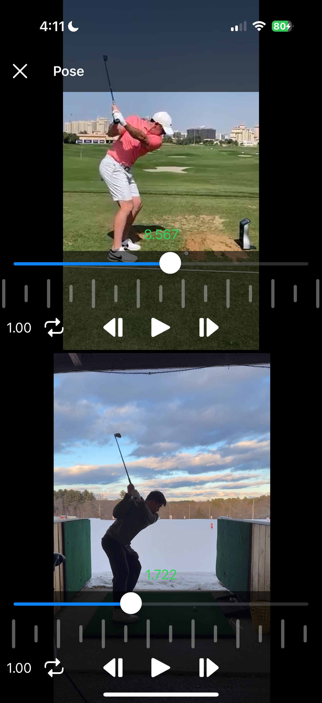
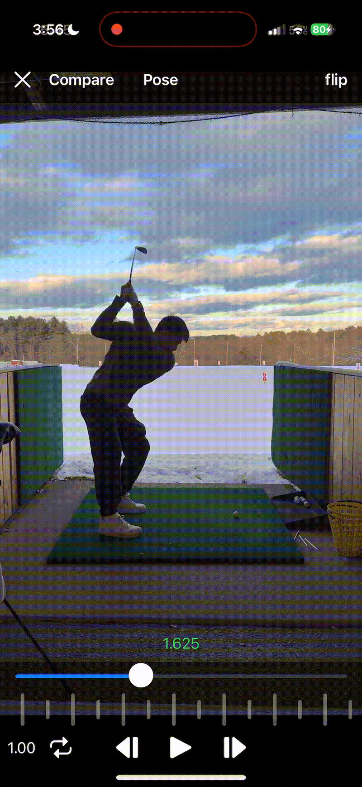

## Overview
Coach is a sports video analysis app designed for anyone trying to review and improve their performance through detailed video feedback. The app enables precise motion analysis with slow-motion playback, frame-by-frame review, and side-by-side video comparisons. 

## Features
- Slow-Motion Playback: Analyze movements with adjustable playback speeds.
- Frame-by-Frame Review: Navigate videos with precision for in-depth analysis.
- Side-by-Side Video Comparison: Compare two videos simultaneously.
- Body Pose Estimation: Uses Apple's Vision framework to detect body pose.
- Automated Video Trimming: Automatically detects and isolates golf swings from longer videos for quick review.

<table>
  <tr>
    <td align="center"><strong>Side-by-Side Comparison</strong></td>
    <td align="center"><strong>Body Pose Estimation</strong></td>
    <td align="center"><strong>Frame by Frame Review</strong></td>
  </tr>
  <tr>
    <td></td>
    <td></td>
    <td></td>
  </tr>
</table>

## Work in progress
Auto golf ball flight tracking using computer vision.

<table>
  <tr>
    <td align="center"><strong>Golf ball tracking</strong></td>
    
  </tr>
  <tr>
    <td></td>
    
  </tr>
</table>

## Technologies Used
- SwiftUI, AVKit, Vision, CoreData, YOLOv11
